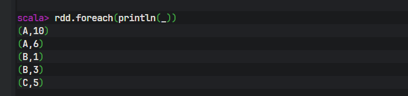
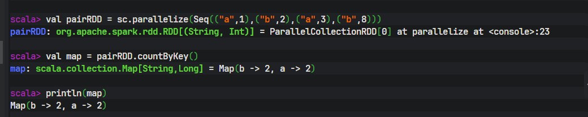
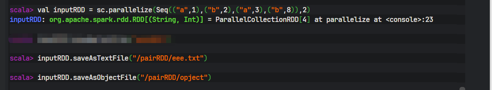
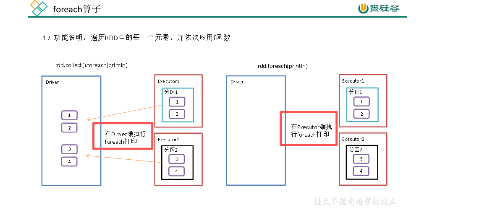

### spark中的转换算子是惰性加载，那在执行行动算子之前转换算子是如何记录下血缘关系

- 在Spark中，转换算子并不“记录”血缘关系，而是在调用它们的瞬间就直接创建了一个包含了完整血缘信息的新RDD对象。血缘关系是RDD对象本身固有的、不可变的数据结构的一部分。

>具体机制如下：
>1. RDD的核心属性：每个RDD都包含以下关键信息，这些共同构成了“血缘”：  
>       - dependencies：一个记录其父RDD依赖的列表。这是血缘关系的核心。
>       - compute：一个函数，定义了如何从父RDD分区计算出当前RDD的分区数据。
>       - partitioner：分区器（对于K-V RDD）。
>       - partitions：分区列表。
> 2. 转换算子的执行过程：
>       - 当你在一个RDD（父RDD）上调用一个转换算子（如.map, .filter, .join）时，这个转换会立即执行，但执行的不是数据计算，而是返回一个新的RDD对象。这个新RDD的dependencies和compute函数会根据你所调用的转换类型被精确设置。

示例：
``` python
val rddA = sc.textFile(...)
# 转换1：立即发生，创建rddB
val rddB = rddA.map(...)
# 内部发生：
# 1. 创建一个新的`MapPartitionsRDD`实例（假设是rddB）。
# 2. 设置 rddB.dependencies = [new OneToOneDependency(rddA)]。
# 3. 设置 rddB.compute = (partition, context) => { 对rddA对应分区的数据应用map函数 }。

# 转换2：立即发生，创建rddC
val rddC = rddB.filter(...)
# 内部发生：
# 1. 创建一个新的`MapPartitionsRDD`实例（rddC）。
# 2. 设置 rddC.dependencies = [new OneToOneDependency(rddB)]。
# 3. 设置 rddC.compute = (partition, context) => { 对rddB对应分区的数据应用filter函数 }。
```

> 3. 血缘的实质：
>       - 最终，你得到的rddC，其内部已经通过dependencies属性，像链表一样指回了rddB，而rddB又指回了rddA。这个由RDD对象通过依赖关系链接而成的有向无环图（DAG）就是血缘。整个图谱在调用行动算子之前就已经在内存中构建完毕。
> 4. 惰性加载的真正含义：
>       - “惰性加载”指的是compute函数中定义的实际数据计算逻辑不会被执行。RDD对象只存储了“如何计算”的蓝图（血缘），直到一个行动算子（如.collect, .count）被调用，Spark的调度器才会读取这个已经存在的血缘图，将其划分为Stage，并生成Task分发到集群执行计算。

*总结*：血缘关系不是被转换算子“记录”下来的，而是在你每次调用转换算子时，*通过创建具有特定依赖关系和计算逻辑的新RDD对象而实时构建出来的。*行动算子的作用是触发调度器去读取并执行这个早已构建好的血缘图。

### spark中什么是pairRDD他和普通的RDD有什么区别，举例简要说明

- PairRDD是普通RDD的一种特例,普通RDD的元素可以是任意类型（T），而PairRDD的元素必须是键值对（Tuple2[K, V]，即 (Key, Value)）。

> 1. 核心操作​: 普通RDD：通用的转换操作，如 map, filter, flatMap。PairRDD:通用的转换操作，如 map, filter, flatMap。
> 2. 设计目的​: 普通RDD：处理通用的分布式数据集合。

- 关键理解：PairRDD的专用操作
> PairRDD的威力在于其基于Key的操作，这些操作会自动在集群上进行洗牌（Shuffle），将相同Key的数据汇聚到同一个节点上进行计算，从而实现高效的聚合。
> 例如 reduceByKey(func)：1. 洗牌前先在本地分区进行合并（Combiner），极大减少了网络传输的数据量。2.然后将相同Key的数据发送到同一个Reduce任务进行全局聚合。而用普通RDD实现类似功能，通常需要先map成(Key, Value)形式，再用groupBy等操作，效率远低于reduceByKey。

- 实际案例

``` scala

// 1. 将普通RDD转换成一个PairRDD，其中Key是单词，Value是初始计数1
val wordPairs = textRDD.flatMap(_.split(" "))
                       .map(word => (word, 1)) // ！！！看这里，转换成了 (K, V) 对

// wordPairs 现在是一个 PairRDD[(String, Int)]

// 2. 使用PairRDD的专用转换操作 `reduceByKey` 进行高效聚合
val wordCounts = wordPairs.reduceByKey(_ + _) // 对相同Key（单词）的Value（1）进行求和

// 行动操作，触发计算
wordCounts.collect().foreach(println)
```

- 代码解读：

> map(word => (word, 1))这一步是创建PairRDD的关键，它将一个元素类型为String的普通RDD，转换成了元素类型为(String, Int)的PairRDD。
> reduceByKey(_ + _)是只有PairRDD才能调用的方法。它告诉Spark：“请将所有相同Key（单词）的Value（1）找出来，然后用_ + _（加法）函数把它们合并起来”。Spark会以高度优化的方式（包含Map端的本地Combiner）执行这个操作。


如何创建PairRDD；
> 通常由普通RDD通过map、flatMap等操作生成键值对来创建：
`val rdd = sc.parallelize(List("apple", "banana", "apple"))
val pairRDD = rdd.map(fruit => (fruit, 1))
// pairRDD: [(apple,1), (banana,1), (apple,1)] `


### spark 中查看分区的详细命令

``` shell 
// 查看 RDD 的分区数
val rdd = sc.parallelize(1 to 100, 5)
rdd.getNumPartitions           // 返回分区数
rdd.partitions.size           // 同上
rdd.partitions.length         // 同上

// 查看分区器
rdd.partitioner               // 返回 Option[Partitioner]
```


### 转换算子

#### map()
- 参数f是一个函数可以写作匿名子类，它可以接收一个参数。当某个RDD执行map方法时，会遍历该RDD中的每一个数据项，并依次应用f函数，从而产生一个新的RDD。即，这个新RDD中的每一个元素都是原来RDD中每一个元素依次应用f函数而得到的。

### flatMap()
- List(List(1,2,3,4),List(5,6,7))  使用spark中的flatMap，将两个list中的结果放在一个list中，结果：List（1，2，3，4，5，6，7）


``` shell
// 导入Spark并初始化SparkContext（假设在Spark shell或独立应用中）
import org.apache.spark.sql.SparkSession

val spark = SparkSession.builder()
  .appName("FlatMapExample")
  .master("local[*]")
  .getOrCreate()
val sc = spark.sparkContext

// 创建包含嵌套列表的RDD
val rdd = sc.parallelize(List(List(1,2,3,4), List(5,6,7)))

// 使用flatMap扁平化列表：每个内部列表映射为其元素
val flattenedRDD = rdd.flatMap(identity)  // 等价于 rdd.flatMap(x => x)

// 收集结果并转换为列表
val result: List[Int] = flattenedRDD.collect().toList

// 输出结果
println(result)  // 输出: List(1, 2, 3, 4, 5, 6, 7)
```


### filter（） 过滤

- 接收一个返回值为布尔类型的函数作为参数。当某个RDD调用filter方法时，会对该RDD中每一个元素应用f函数，如果返回值类型为true，则该元素会被添加到新的RDD中。
2）需求说明：创建一个RDD，过滤出对2取余等于0的数据


### mapPartitions算子

- mapPartitions 和 map 的区别
> map算子是一对一的操作，会将一个RDD中的每一个元素都映射到另一个RDD中；而mapPartitions算子是一对多的操作，它会将一个RDD中的每一个分区都映射到另一个RDD中，每个分区中的元素会被一次性处理，减少了操作次数，提高了处理效率。mapPartitions和map算子是一样的，只不过map是针对每一条数据进行转换，mapPartitions针对一整个分区近进行转换


### groupBy()分组

- 分组，按照传入函数的返回值进行分组。将相同的key对应的值放入一个迭代器。

> groupBy会存在shuffle过程
> shuffle：将不同的分区数据进行打乱重组的过程
> shuffle一定会落盘。


### distinct()

- 功能说明：对内部的元素去重，并将去重后的元素放到新的RDD中。
*注意：distinct会存在shuffle过程*


###  sortBy()排序

- 该操作用于排序数据。在排序之前，可以将数据通过f函数进行处理，之后按照f函数处理的结果进行排序，默认为正序排列。排序后新产生的RDD的分区数与原RDD的分区数一致。Spark的排序结果是全局有序。*sortBy()是全局排序操作，会触发shuffle*  默认情况下，结果的所有分区都是全局有序的,排序后每个分区内部有序，分区之间也是有序的

> sortBy() 案例：
> ``` shell
// 原始数据分布
val rdd = sc.parallelize(
  Seq(1, 6, 4, 3, 1, 6, 2, 9),  // 所有数据
  numSlices = 2                  // 初始分为2个分区
)

// 查看初始分区
rdd.mapPartitionsWithIndex { (index, iter) =>
  println(s"原始分区$index: ${iter.toList.sorted}")
  Iterator.empty
}.collect()

// 输出：
// 原始分区0: List(1, 3, 4, 6)  // 这是您的数据
// 原始分区1: List(1, 2, 6, 9)  // 这是您的数据
```
- 执行的结果
``` shell
// 执行全局排序
val sortedRDD = rdd.sortBy(x => x)  // 升序排列

// 查看排序后的分区
sortedRDD.mapPartitionsWithIndex { (index, iter) =>
  println(s"排序后分区$index: ${iter.toList}")
  Iterator.empty
}.collect()

// 实际输出：
// 排序后分区0: List(1, 1, 2, 3)  // 全局最小的4个元素
// 排序后分区1: List(4, 6, 6, 9)  // 全局最大的4个元素
```


- 如果只是想让每个分区中的有序，要结合 mapPartition()方法

``` shell 
// 方法1：使用mapPartitions在每个分区内部排序
val partitionSorted = rdd.mapPartitions(iter => 
  iter.toList.sorted.toIterator
)

// 方法2：使用sortWithinPartitions（仅在DataFrame API中可用）
// 对于RDD，没有直接的sortWithinPartitions方法
```

### key_value 类型

#### groupByKey()按照K重新分组

- 功能说明：groupByKey对每个key进行操作，但只生成一个seq，并不进行聚合。该操作可以指定分区器或者分区数（默认使用HashPartitioner）

- groupByKey是Spark中的一个重要的转换操作，它的作用是对每个key对应的元素进行分组，然后将分组后的结果以key-value的形式返回，
- 其中key是原来的key，value是一个迭代器，迭代器中存放的是key对应的所有元素。
- groupByKey算子可用于对RDD中的元素进行分组，有时也可以用于聚合操作，但它的性能要比其他聚合函数低得多，因此一般情况下*不推荐使用。*

``` shell
val works = sc.parallelize(Seq(("勇哥", 100), ("勇哥", 98), ("小明", 97))).groupByKey()
scala> println(works.collect().foreach(println(_)))

// 结果
(勇哥,CompactBuffer(100, 98))                                                   
(小明,CompactBuffer(97))

```

#### reduceByKey() 

- reduceByKey((V, V) ⇒ V, numPartition)
- reduceByKey算子是spark中用于对pairRDD中key相同的元素进行聚合的算子。
- 它的作用是对pairRDD中的每个key的元素都进行reduce操作，将key对应的value值聚合到一起，从而实现对pairRDD的聚合操作。

``` shell
val rdd = sc.parallelize(Seq(("勇哥", 100), ("勇哥", 98), ("小明", 97))).reduceByKey((a,b)=> a+b)

// 结果
scala> rdd.collect().foreach(println(_))
(勇哥,198)
(小明,97)
```


####  reduceByKey和groupByKey区别
- reduceByKey：按照key进行聚合，在shuffle之前有combine（预聚合）操作，返回结果是RDD[K,V]。
- groupByKey：按照key进行分组，直接进行shuffle
- 开发指导：在不影响业务逻辑的前提下，优先选用reduceByKey。求和操作不影响业务逻辑，求平均值影响业务逻辑。影响业务逻辑时建议先对数据类型进行转换再合并。


#### sortByKey()
在一个(K,V)的RDD上调用，K必须实现Ordered接口，返回一个按照key进行排序的(K,V)的RDD。

``` shell 
val rdd = sc.parallelize(Seq(("A",10),("B", 1),("A", 6),("C", 5),("B", 3))).sortByKey(true).collect()

// 结果

```


### 行动算子

### collect() 以数组的形式返回数据集

- 功能说明：在驱动程序中，以数组Array的形式返回数据集的所有元素。
*注意：所有的数据都会被拉取到Driver端，慎用。*


### count()

- 功能说明：返回RDD中元素的个数

- count()的计算过程：
> 1. 分布式并行统计：Driver会向各个Executor上的分区（Partition）发起任务，每个任务独立计算自己分区内的数据条数。
> 2. 汇总结果：Driver收集所有分区返回的局部计数。
> 3. 全局求和：Driver将这些局部计数相加，得到整个数据集（RDD、DataFrame或Dataset）的最终总行数.


###  first()返回RDD中的第一个元素

- 在Spark中，first()函数的作用是返回数据集的第一个元素。在大多数未明确排序且数据分布均匀的情况下，它的行为确实常常表现为返回第一个分区（Partition 0）的第一个元素。


- first()返回第一个被计算出的分区的第一个元素，在没有定义全局排序的情况下，这通常是最小编号分区的第一个元素，但它不保证是数据逻辑上的“第一条记录”。​ 如果需要确定的、基于某个字段的“第一条记录”，必须先用 orderBy进行排序。

- 与 take(1)的关系：first()在功能上完全等价于 take(1).head，但 first()的执行可能更高效，因为它找到第一个元素后就可以停止。


### take(n) 

- 在Spark中，take(n)函数的行为正是如此。它是一个行动（Action）​ 操作，用于从数据集中返回前n个元素。其具体实现逻辑可以概括为：
1. 按分区顺序获取：Spark会从分区编号最小的分区（通常是Partition 0）开始，依次获取其分区内的元素。
2. 顺序填充：从第一个分区中按顺序取出元素，如果该分区的元素个数小于n，则继续从下一个分区（Partition 1）中按顺序取元素，依此类推，直到取满n个元素或遍历完所有分区为止。
3. 返回结果：将这些收集到的元素以数组（或Seq）的形式返回到Driver端。


- 与 collect()的区别：take(n)只收集前n个元素到Driver，而 collect()会收集所有分区的所有元素，因此在数据量很大时，take(n)的开销和风险（如Driver内存溢出）要小得多


### countByKey() 统计每种key的个数




### save相关算子

- saveAsTextFile(path)保存成Text文件

> 功能说明：将数据集的元素以textfile的形式保存到HDFS文件系统或者其他支持的文件系统，对于每个元素，Spark将会调用toString方法，将它装换为文件中的文本

- saveAsObjectFile(path) 序列化成对象保存到文件
> 功能说明：用于将RDD中的元素序列化成对象，存储到文件中。



spark中ollect().foreach() 方法是将每个Executor上RDD的元素放在Driver上进行遍历动作并打印，如果数据据过大，都放在Driver上执行可能导致Driver这台服务器OOM，并且效率极低。分布式中只使用foreach()方法是遍历RDD这个动作是在Executor端进行打印，然后将执行的结果回传到Driver

### foreach() 遍历RDD中的元素




### foreachPartition()
foreachPartition ()遍历RDD中每一个分区