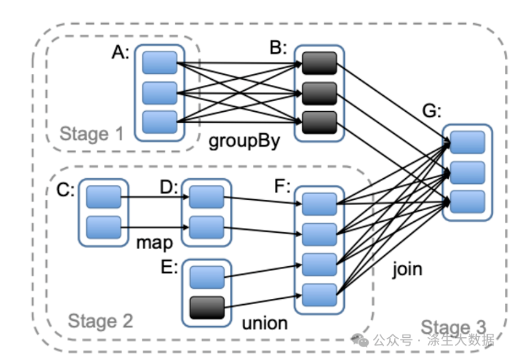

### 常用查看RDD血缘关系命令

- 查看RDD的血缘关系
> println(rdd3.toDebugString)

- 查看 DataFrame/Dataset 的血缘关系
> df.explain(true)

- 使用 SparkContext 查看 RDD 依赖关系
``` shell
// 查看 RDD 的依赖链
rdd3.dependencies.foreach { dep =>
  println(s"Dependency type: ${dep.getClass.getSimpleName}")
  println(s"Parent RDD: ${dep.rdd}")
}

// 查看所有依赖的 RDD
rdd3.getAllDependencies.foreach(println)
```


### 需要shuffle的算子

- 1. ByKey 操作（需要 Shuffle）
> 这些操作需要将相同 key 的数据拉到同一个分区：
> - reduceByKey(func)
> - groupByKey()
> - aggregateByKey(zeroValue)(seqOp, combOp)
> - combineByKey(createCombiner, mergeValue, mergeCombiners)
> - foldByKey(zeroValue)(func)
> - sortByKey(ascending)

- 2. 重分区操作
> - repartition(numPartitions)- 增加或减少分区数，总会触发 Shuffle
> - coalesce(numPartitions, shuffle=true)- 当 shuffle=true时触发 Shuffle
> - partitionBy(partitioner)- 使用自定义分区器重新分区

- 3. 连接操作（Join）
> - join(otherDataset, numPartitions)- 当两个 RDD 没有相同的分区器时
> - cogroup(otherDataset)- 协分组
> - fullOuterJoin, leftOuterJoin, rightOuterJoin

- 4. 集合操作
> - intersection(otherDataset)- 交集
> - subtract(otherDataset)- 差集
> - distinct(numPartitions)- 去重（内部实现为 reduceByKey）
> - cartesian(otherDataset)- 笛卡尔积（特殊的宽依赖）

- 5. 其他需要 Shuffle 的操作
> - sortBy(func, ascending, numPartitions)- 排序
> - repartitionAndSortWithinPartitions(partitioner)- 重分区并排序

*记住：宽依赖 = Shuffle = 性能关键点。在编写 Spark 作业时，应尽量减少宽依赖操作，或者对宽依赖操作进行优化（如使用合适的聚合器、调整分区数、使用广播等）。*


### RDD任务切分中间分为：Application、Job、Stage和Task

- Application : 创建一个SparkContext环境，即生成一个Application
- Job ： 一个 Action算子就是一个job
- Stage ： Stage的个数是宽依赖的个数加1
- Task ：一个Stage阶段中，最后一个RDD的分区个数就是Task的个数
*注意：Application->Job->Stage->Task每一层都是1对n的关系。* 


### YarnClient 运行模式

步骤1: 在客户端启动 Driver
     ↓
步骤2: Driver 向 YARN ResourceManager 申请启动 ApplicationMaster
     ↓
步骤3: ResourceManager 分配 Container，启动 ApplicationMaster
     ↓
步骤4: ApplicationMaster 向 ResourceManager 申请 Executor 资源
     ↓
步骤5: 在分配的 Container 中启动 Executor
     ↓
步骤6: Executor 反向注册到 Driver
     ↓
步骤7: Driver 分发任务到 Executor
     ↓
步骤8: Executor 执行任务，返回结果给 Driver


### Stage的划分



- 宽依赖是stage划分的界限，连续的窄依赖属于是同一个stage
- stage是从最后一个RDD开始逆向分析  
- 最后的Stage为ResultStage类型，除此之外的Stage都是ShuffleMapStage类型。

> 比如上图中，在RDD G处调用了Action操作，在划分Stage时，会从G开始逆向分析，G依赖于B和F，其中对B是窄依赖，对F是宽依赖，所以F和G不能算在同一个Stage中，即在F和G之间会有一个Stage分界线。上图中还有一处宽依赖在A和B之间，所以这里还会分出一个Stage。最终形成了3个Stage，由于Stage1和Stage2是相互独立的，所以可以并发执行，等Stage1和Stage2准备就绪后，Stage3才能开始执行。另外最后的Stage为ResultStage类型，除此之外的Stage都是ShuffleMapStage类型。


### RDD Cache持久化

RDD 通过 Cache和Persist 方法将前面的计算结果缓存，

