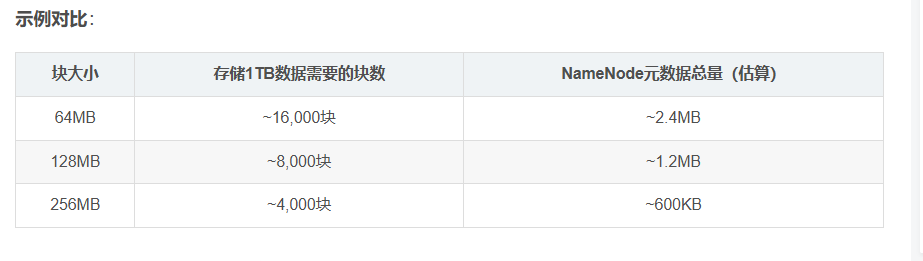
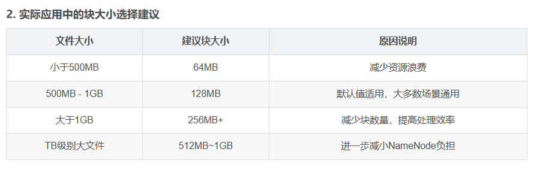

### hadoop基础
#### 1. Hadoop1.x、Hadoop2.x和3.X的区别
> 在Hadoop1.X时代MapReduce组件负责的是业务逻辑处理和资源调  度，Hadoop2.X时代增加了yarn，将MapReduce中的资源调度功能分离出来，进行架构上的解耦，让MapReduce只负责业务逻辑处理。  
>
> Hadoop2.0时代将zookeeper加入实现了Hadoop的高可用  
> Hadoop3.x时代
> 1. java的运行环境调到了1.8
> 2. 添加了单active namenode + 多 standy NameNode的部署方式，提升了Hadoop的高可用
> 3. MapReduce本地优化，性能提升了30%
> 4. 良好的可视化界面，方便操作

#### 2. 集群的最主要瓶颈
- 一个出色的回答应该展示出你对集群生命周期和复杂性的理解。可以从以下结构化、有深度的角度进行阐述：
实例结合（武汉市肺科医院的数据体量上升到武汉市全市的日上报数据）
**核心观点**
> Hadoop集群的瓶颈是一个动态变化的问题，它主要取决于集群的发展阶段、业务负载类型和资源配置。整体来看，瓶颈会从硬件资源层，逐渐向数据与计算模型层迁移

分阶段进行阐述:  
**初期**
> 当集群规模较小任务负载突然增长时，瓶颈通常体现在基础的硬件资源上
> 1. **磁盘I/O**：HDFS的读写密集型操作（尤其是Shuffle阶段）会造成磁盘吞吐瓶颈。使用JBOD配置的多个廉价磁盘比单个RAID更有利于分散I/O压力。  
> 2. **网络带宽**：Map和Reduce任务之间的数据洗牌（Shuffle）会产生巨大的跨节点流量。在千兆网络环境中，这极易成为最关键的瓶颈。
> 3. **内存容量**：YARN容器内存、Map/Reduce任务堆内存，以及HDFS的读写缓存，都直接受限于物理内存。配置不当极易引发OOM或频繁的垃圾回收，导致任务缓慢甚至失败（正如我们之前遇到的虚拟内存超限问题）。
> 4. **CPU核数**：对于计算密集型的任务（如复杂的Hive SQL或Spark计算），可用的vCore数量会限制任务的并行度。

**硬件升级后**  
当硬件升级后，瓶颈往往转移到配置和软件使用方式上：
>1. **资源配置不当**：mapreduce.map.memory.mb、yarn.nodemanager.resource.memory-mb等核心参数配置不合理，会导致资源利用不充分或冲突。
>2. **小文件问题**：海量小文件会压垮NameNode的内存元数据管理，并导致Map任务启动开销巨大，严重降低处理效率。
>3. **数据倾斜**：这是最常见的计算瓶颈。少数几个Reduce任务处理绝大部分数据，导致任务拖尾，其他节点空闲等待。
>4. **不合理的分区与索引**：在Hive等数据仓库中，缺乏有效的分区和索引会导致全表扫描，产生不必要的I/O和计算。

**架构与数据模型瓶颈**
>1. **作业调度与资源竞争**：多租户环境下，不当的资源调度策略（如FIFO）会导致重要任务被阻塞，资源利用率不均。
>2. **存储与计算耦合**：Hadoop原生架构将存储（HDFS）和计算（YARN）强绑定在同一集群，可能导致一方资源紧张而另一方闲置，资源弹性差。

**总结升华**
>1. **强调诊断方法**：“在实际运维中，我们通过自上而下的监控链来定位瓶颈：先从YARN Application Master和Resource Manager的Web UI看应用整体进度和资源申请情况；再定位到慢任务，查看对应Container的日志；最后结合集群监控（如Ganglia）查看该节点实时的磁盘I/O、网络流量和CPU负载。例如，我们之前通过日志发现容器因虚拟内存超限被Kill，就是通过分析Container的stderr日志定位到的。”
> 2. **给出解决思路**：“解决瓶颈也需要分层处理：硬件层考虑升级或扩容；配置层进行精细化的参数调优；数据层通过预处理解决倾斜和小文件；架构层可以考虑引入更弹性的计算框架（如Spark）或存算分离架构。”

#### 3. Hadoop（MR）和spark的主要区别 (必问！！！)

> 1. Hadoop的MR是基于磁盘进行数据处理的，而Spark是基于内存。Spark的内存计算引擎，提供Cache机制来支持需要反复迭代计算或者多次数据分享，减少数据读取的IO开销。
> 2. MR的中间结果存放在HDFS中，每次MR都需要刷写-调用，涉及多次的落盘和磁盘IO，效率不高。而Spark中间结果优先存放在内存中，内存不够再存放在磁盘中，不放入HDFS中，避免了大量的IO开销和读写操作。 
> 3. MR只能离线计算，而Spark既可以离线也可以实时
> 4. 相比Hadoop对于数据只提供了Map和Reduce两个操作，Spark提供了丰富的算子，可以通过rdd转换算子和rdd行动算子，实现很多复杂算法操作，这些复杂的算法在Hadoop中需要自己去编写，而在Spark中是已经用scala封装好的，直接调用就ok
> 5. Spark容错率高。Spark引进弹性分布式数据集RDD的抽象，他是分布在一组节点中的只读对象集合，这些集合是弹性的，如果一部分数据丢失，则可以根据血缘关系对他们进行重建。另外在RDD计算时，可以通过CheckPoint来实现容错。
> Spark 基于 DAG 的任务调度执行机制比MapReduce的迭代执行更高效。

### Hadoop-HDFS
#### 1.HDFS的组成架构
> 1. NameNode: 管理HDFS的名称空间；配置副本策略；管理数据块block的映射信息(此映射不持久化存储，由DataNode上报动态生成)；处理客户端读写请求;数据的存储：FsImage：文件系统元数据的完整快照，存储在磁盘中。是持久化文件。EditLog：在FsImage基础上，所有对元数据的修改操作的记录日志。启动时，NameNode会将FsImage加载到内存，并重播EditLog，在内存中构建完整的元数据视图。
> 2. DataNode: 存储实际的数据块block；执行数据块的读/写操作；定期汇报：通过心跳（Heartbeat，默认3秒）向NameNode报告自身存活状态
> 3. Client: 文件切分。文件上传到hdfs的时候。Client将文件切成一个一个的Block，然后进行上传  
> 与NameNode交互，获取文件的位置信息；  
> 与DataNode交互，进行文件的读/写操作；  
> Client 提供一些命令对HDFS进行操作，比如NameNode的初始化
> Client 可以通过一些命令来访问HDFS，比如对HDFS进行增删查询操作
> 4. Secondary NameNode:在非HA集群上，并非Name Node的热备。当NameNode挂掉的时候，并不能马上进行替换；主要是辅助NameNode，分担其工作量，定期进行Fsimage和Edits合并
> 5. 高可用中的NameNode:主备NameNode：引入一对主-备NameNode。它们通过共享存储（如Quorum Journal Manager, QJM）来同步EditLog，确保元数据状态一致。故障自动切换：通过ZooKeeper等工具监控主NameNode状态。当主节点故障时，自动触发故障转移，将备用节点提升为新的主节点，实现服务不中断。
#### 2. 使用Hadoop需要启动哪些进程?
- (HA)高可用集群
> 1. HDFS :NameNode主节点进程，管理文件系统的元数据（命名空间、数据块映射）。DataNode:从节点进程，存储实际数据块。在集群的每一台工作节点（Slave Node）上都需要启动。
> 2. Yarn:ResourceManager (rm)：主节点进程，负责整个集群的资源（CPU、内存）管理和调度。每个集群通常一个。NodeManager (nm)：从节点进程，负责管理单个节点上的资源和任务执行。在每一台工作节点上都需要启动。
> 3. MapReduce:JobHistoryServer (jhs)：历史任务服务器，用于查看已完成的MapReduce作业的日志和统计信息。通常在独立节点上启动一个.
> 4. JournalNode (jn)：通常由3个或以上奇数个节点组成，用于共享存储NameNode的编辑日志（EditLog），实现主备NameNode元数据同步。
> 5. ZKFC:与ZooKeeper协同工作，监控NameNode健康状态并自动进行故障转移。
#### 3. hdfs适合存储什么样地数据
> HDFS 是专为“一次写入、多次读取”的大规模流式数据访问而设计
> 1. 超大文件（GB、TB甚至PB级）:HDFS 将文件切分成典型为 128MB 或 256MB 的数据块，并将其分散存储在集群中。大文件能完美利用这种分块存储和并行处理的优势，将元数据开销（由 NameNode 管理）降至最低。
#### 4. HDFS 中的 block 默认保存几份？（2）
- HDFS 中默认的数据块（Block）副本数量是 3 份
> 可以在 $HADOOP_HOME/etc/hadoop/hdfs-site.xml配置文件中修改 dfs.replication的值，来调整整个集群的默认副本数。
- 设置副本的目的
> 1. 高容错性：当某个节点或磁盘发生故障时，数据不会丢失，因为还有其他副本可用。
> 2. 高可用性：客户端可以从多个副本位置读取数据，提高了并行读取的效率和系统的整体吞吐量。
#### 5. HDFS 默认 BlockSize 是多大？
> hadoop1.x时代是64MB
> hadoop2.x/3.x时代是128MB
> 可以在配置文件 $HADOOP_HOME/etc/hadoop/hdfs-site.xml中，通过修改 dfs.blocksize属性来调整默认的块大小。单位是字节

#### 6. NameNode将元数据保存在哪里
-内存和磁盘。内存用于高速服务，磁盘用于持久化备份
> NameNode 在启动时会将磁盘中完整的元数据加载到内存中。
#### 7. HDFS为什么是128M (2)
> 1. 减少 NameNode 的内存开销:NameNode 是 HDFS 的元数据中心，它负责记录每个文件的块信息。每一个块在内存中都需要占用一定的空间（约150字节/块）。如果块太小，则会显著增加 NameNode 的内存负担。

> 2. 提高数据传输效率（减少磁盘和网络I/O频率）:较大的块意味着:每次传输的数据量大，网络连接建立频率少,减少磁盘查找次数，提升顺序读写效率.在大数据场景中，顺序读写远远优于随机读写，大块数据能更好地发挥磁盘吞吐能力。
> 3. 适配并行计算框架（如MapReduce）:MapReduce 框架按块划分输入分片（InputSplit）。通常，一个块对应一个Mapper。块小→Mapper多→作业调度复杂，反之则简化调度过程。大块使得每个 Mapper 能充分发挥其 CPU 和 I/O 能力，避免频繁切换任务，提高任务处理效率。MapReduce 会尽量将计算调度到数据本地节点上运行，大块数据能使本地化调度效果更显著，减少网络传输。
> 4. 灵活匹配块大小：

#### 8. HDFS 副本放置策略(2)
- 它的默认放置规则是这样的：第一个副本放在客户端所在节点（如果客户端不在集群内则随机选一个），第二个副本放在不同机架的节点，第三个副本放在第二个副本相同机架的另一个节点。
- 但在实际生产环境中会遇到两个典型问题
> 数据本地化率低：当计算任务（比如MapReduce）调度到没有数据副本的节点时，需要跨网络拉取数据，造成明显的性能瓶颈
> 机架感知失效：在云环境或动态扩展的集群中，传统机架拓扑信息可能不准确
- 解读办法：
解决这个问题的核心在于让数据尽量靠近计算。我们主要从三个维度进行优化：
> 1. 动态拓扑感知：不再依赖静态的机架配置，而是通过心跳包动态计算节点间的网络距离,5ms的定义为
> 2. 负载感知放置：避免将多个副本集中到高负载节点，在Hdfs的BlockPlacementPolicy中增加负载因子大于0.8的判断
> 3. 读写分离优化：对冷热数据采用不同的副本策略，对已有文件需要执行hadoop fs -setrep -R命令重建副本
#### 9. HDFS的存储机制（重要）HDFS存储机制，包括HDFS的写入数据过程和读取数据过程两部分
- 写流程
> 1. **文件创建**：客户端调用 DistributedFileSystem.create()方法，发起 RPC 请求到 NameNode。NameNode 检查目标文件是否已存在、父目录是否存在、客户端是否有权限。检查通过后，在命名空间（元数据）中创建文件记录，并将操作日志写入 EditLog。随后，NameNode 将一个 FSDataOutputStream 对象返回给客户端，用于后续写数据。
> 2. **数据分块**：客户端开始写入数据。FSDataOutputStream会将数据在内存中按默认 128MB 大小进行分块，但并非一次性切分整个文件，而是流式地填充和发送每个块。
> 3. **请求数据节点**：当客户端准备好写入第一个数据块时，会向 NameNode 申请一组（默认3个）用于存储该数据块副本的 DataNode 地址列表。NameNode 会根据副本放置策略（如第一个副本在本地机架，第二个在另一机架等）返回列表。
> 4. **建立数据管道**：客户端与这组 DataNode 之间建立一个数据写入管道。客户端将数据包依次发送给管道中的第一个 DataNode，第一个 DataNode 接收后存储到本地，并同时将数据包转发给管道中的第二个 DataNode，依此类推。
> 5. **数据流式写入**：
客户端从磁盘或内存中读取数据，组成一个个数据包（Packet，通常为64KB），放入一个数据队列。
数据包被依次发送到管道。同时，客户端还会维护一个确认队列，等待确认。
管道末端的 DataNode 成功接收并暂存一个 Packet 后，会沿管道反向发送一个确认包（ACK），最终传回客户端。
客户端收到确认后，将该 Packet 从确认队列中移除。如果超时未收到确认，会触发数据包重传机制。
> 6. **块完成与后续**：当一个数据块的所有 Packet 都发送完毕，并收到了所有 DataNode 的最终确认，客户端会向 NameNode 报告该块写入成功。NameNode 更新元数据。然后，客户端重复步骤 3-6，开始写入文件的下一个数据块。
> 7. **关闭**：所有数据块写入完成后，客户端调用 close()方法关闭输出流。此时，客户端会通知 NameNode 文件写入完成，NameNode 会等待所有副本达到最小副本数后，最终提交文件。  

- 读流程
> 1. 发起请求：客户端调用 DistributedFileSystem.open()方法，向 NameNode 发起 RPC 请求，获取文件的数据块定位信息。
> 2. 获取元数据：NameNode 验证权限后，返回文件中每个数据块及其所有副本所在的DataNode地址列表。该列表已按与客户端的网络拓扑距离进行了排序。
> 3. 建立数据流：客户端获得 FSDataInputStream对象。在读取时，它根据“就近原则”，从第一个数据块的DataNode列表中选择距离最近的一个，与之建立连接。
> 4. 流式数据读取：
DataNode 从磁盘读取相应的数据块，以数据包（Packet）为单位流式地发送给客户端。
客户端接收这些数据包，先缓存在本地，然后应用程序可以从输入流中读取。
如果当前连接的DataNode发生故障，输入流会自动、透明地切换到该数据块列表中的下一个最优DataNode。
> 5. 读取后续数据块：当第一个数据块读取完毕后，FSDataInputStream会立即向 NameNode 获取下一个数据块的位置信息，并重复步骤3-4，直到文件读取完成。
> 6. 关闭：客户端完成读取后，关闭 FSDataInputStream。
#### 10. HDFS DataNode死了怎么办，NameNode发生了什么变化？掉线时限参数设置。(DataNode的工作机制)
1、一个数据块在DataNode上以文件形式存储在磁盘上，包括两个文件，一个是数据本身，一个是元数据包括数据块的长度，块数据的校验和，以及时间戳
2、DataNode启动后向NameNode注册，通过后，周期性（6小时）的向NameNode上报所有的块信息
3、心跳是每3秒一次，心跳返回结果带有NameNode给该DataNode的命令，如复制块数据到另一台机器，或删除某个数据块。如果超过10分钟没有收到某个DataNode的心跳，则认为该节点不可用
4、集群运行中可以安全加入和退出一些机器

- 数据的完整性
以下是DataNode节点保证数据完整性的方法。
1、当DataNode读取Block的时候，它会计算CheckSum
2、如果计算后的CheckSum，与Block创建时值不一样，说明Block已经损坏
3、Client读取其他DataNode上的Block
4、常见的校验算法crc（32），md5（128），sha1（160）
5、DataNode在其文件创建后周期验证CheckSum

- 掉线时限参数设置
1、DataNode进程死亡或者网络故障造成DataNode无法与NameNode通信，NameNode不会立即把该节点判定为死亡，要经过一段时间，这段时间暂称作超时时长，HDFS默认的超时时长为10分钟+30秒
2、如果定义超时时间为TimeOut，则超时时长的计算公式为：
TimeOut = 2 * dfs.namenode.heartbeat.recheck-interval + 10 * dfs.heartbeat.interval
hdfs-site.xml配置文件中的heartbeat.recheck.interval的单位为毫秒，dfs.heartbeat.interval的单位为秒
#### 11. 高可用中Hadoop中NameNode宕了怎么办
#### 14. HAnamenode如何工作?
#### 15. Hadoop HA的实现，脑裂问题
#### 16. hdfs小文件过多会怎么样
#### 17. ETL的过程？
#### 19. Hadoop常见的压缩算法有哪些？（2）

### Hadoop-MapReduce
#### 1.MR原理。Hadoop计算原理，MR过程详细讲一下？（必问！！！6）
####2. Maptask的个数由什么决定？
####3. 如果没有定义partitioner，那数据在被送达reducer前是如何被分区的？
####4. MapReduce 出现单点负载多大，怎么负载平衡？
####5.如何使用mapReduce实现两个表的join?
####6.什么样的计算不能用mr来提速？
####7. MR的shuffle机制了解吗（4必问！！！）
####8. mapreduce中间有个combine是干嘛的（3），有什么好处，有什么使用限制吗？和reduce的区别？
####9. combine和merge的区别
####10. reduce任务什么时候开始呢？
####11. 关闭正在执行的MR任务用什么命令
####12. mapreduce shuffle为什么要环形缓冲区，底层（3）
####13. 如何确定map数量
####14. MR运行过程中会发生OOM，OOM发生的位置？
####15. hadoop动态增删节点怎么做？
   
###Hadoop-Yarn
####1. 为什么会产生 yarn,它解决了什么问题，有什么优势？
####2. HDFS的数据压缩算法?
####3. 调度器（2）
####4. Hadoop的调度器总结
####5. mapreduce推测执行算法及原理
####6. MapReduce跑得慢的原因？
####7. MapReduce优化方法
####8. HDFS小文件优化方法
####9. Yarn的结构（3）
####10. RM和NM的交互，如何分配任务的。Yarn的工作原理(3)
####11. 场景，很多牛逼的电脑，大CPU大内存，网卡超烂，如何优化？
####12. 处理数据倾斜(2) 31
####13. Hadoop的XML配置文件有哪些(2), 改过哪些参数, 分别代表什么含义
####14. hadoop有哪两大服务
####15. 容器是什么。什么东西调用这个机器的资源？container是以什么形式存在于内存当中。（本质上也是一种线程）。