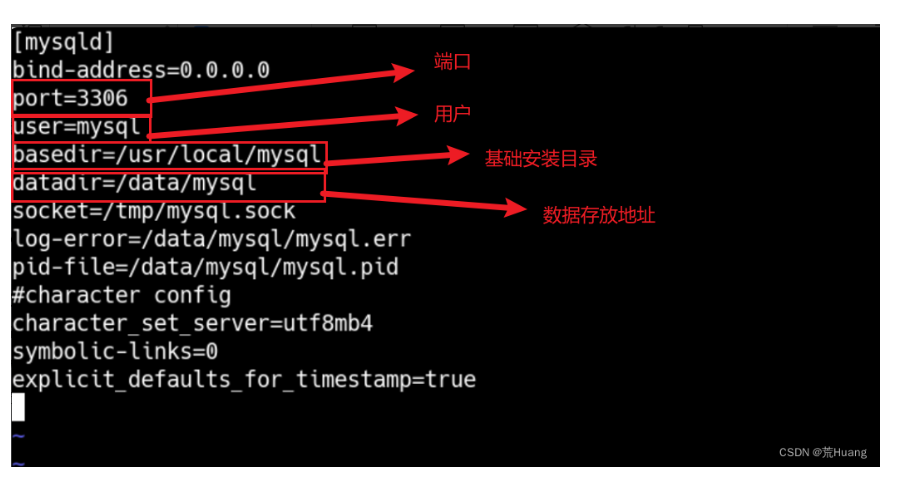

### 安装Mysql
1. 安装主机在hadoop-dn1机器上
2. 安装命令：`wget https://mirrors.huaweicloud.com/mysql/Downloads/MySQL-8.0/mysql-8.0.28-linux-glibc2.12-x86_64.tar.xz`
3. 创建目录: `sudo mkdir /opt/mysql`,`sudo mkdir /opt/data/mysql`
4. 解压：`sudo tar -xvf mysql-8.0.28-linux-glibc2.12-x86_64.tar.xz -C /opt/mysql/`
5. 创建用户组和用户：`groupadd mysql`,`useradd -g mysql mysql`
6. 修改mysql配置文件:`vim /etc/my.cnf`

7. 初始化并启动mysql：`cd /opt/mysql/mysql-8.0.28/bin`,`./mysqld --defaults-file=/etc/my.cnf --basedir=/opt/mysql/mysql-8.0.28 --datadir=/opt/mysqlData/ --user=mysql --initialize`
8. 查看mysql的密码：` cat /opt/mysqlData/mysql.err`
9. 初始化密码：` root@localhost: Tm9=SKhNlFU#`
10. 先将mysql.server放置到/etc/init.d/mysql中:/etc/init.d 目录通常用于存放启动脚本，这些脚本用于管理系统服务的启动、停止和重启。`cp /opt/mysql/mysql-8.0.28/support-files/mysql.server /etc/init.d/mysql`
11. 启动Mysql：service mysql start
12. 查看进程：ps -ef|grep mysql

13. 修改root账号密码：修改root账号密码`cd /opt/mysql/mysql-8.0.28/bin`
> 如果输入上面的看到的密码不能登录或者不想输入密码登录 我们可以在my.cnf中设置跳过密码验证直接登录，在my.cnf添加skip-grant-tables，然后重启mysql,service mysql restart。重启之后输入登录mysql的命令之后，提示输入密码的时候直接回车即可。

14. 修改密码：`ALTER USER 'root'@'localhost' IDENTIFIED BY '123456';``flush privileges;`刷新权限; 重启mysql

15. 开启mysql允许远程访问
> 1. 查看所有数据库:show databases;
> 2. 切换到mysql数据库: use mysql;
> 3. `使用命令开启任何主机都能远程访问MySQL:update user set host='%' where user='root';``flush privileges;`

16. 添加环境变量：`export PATH=$PATH:/opt/mysql/mysql-8.0.28/bin`

## Hive的安装
### 下载Hive3.1.3

- 华为云下载：`wget https://mirrors.huaweicloud.com/apache/hive/hive-3.1.3/apache-hive-3.1.3-bin.tar.gz`

1. 解压
2. 修改/opt/module/hive-3.1.3/conf下的hive-site.xml，将hive-default.xml.template重命名为hive-default.xml,`cp hive-default.xml.template hive-default.xml`
3. 下载mysql驱动命令：wget https://repo1.maven.org/maven2/com/mysql/mysql-connector-j/8.0.33/mysql-connector-j-8.0.33.jar

#### 准备mysql驱动包放在hive对应lib目录下
mv mysql-connector-java-5.1.38.jar $HIVE_HOME/lib/
#### 替换hive guava包
#### 由于hadoop对应的guava包与hive中使用的guava包冲突，启动hive会导致某些类找不到，所以需要将hadoop对应的高版本guava替换掉hive中的guava包
rm -f $HIVE_HOME/lib/guava-19.0.jar
cp $HADOOP_HOME/share/hadoop/hdfs/lib/guava-27.0-jre.jar $HIVE_HOME/lib/
#### 初始化及启动hive(必须先启动hdfs和yarn)
#### 在hive2.x版本之后，首次启动hive都需要初始化，初始化主要是创建对应的元数据信息
schematool -dbType mysql -initSchema
#### 启动hive测试，Hive-on-MR在Hive 2中已弃用，并且可能在未来的版本中不可用。考虑使用不同的执行引擎(例如spark, tez)，即Hive支持多个执行引擎，例如MR和Spark，MR已经废弃了用的很少了
hive
...
Hive-on-MR is deprecated in Hive 2 and may not be available in the future versions. Consider using a different execution engine (i.e. spark, tez) or using Hive 1.X releases
#创建表test 
create table if not exists test (id int,name string,age int);
#### 插入一条数据，会生成MR任务
insert into test values (1,"zhangsan",18);
#### 查询
select * from test;
#### 退出
exit;

#### 查看相应的hdfs信息
hdfs dfs -ls -R /user/hive
drwxr-xr-x   - bigdata supergroup          0 2024-03-13 23:30 /user/hive/warehouse
drwxr-xr-x   - bigdata supergroup          0 2024-03-13 23:31 /user/hive/warehouse/test
-rw-r--r--   3 bigdata supergroup         14 2024-03-13 23:31 /user/hive/warehouse/test/000000_0

#### node02
#### 登录mysql，查看元数据库hive
mysql -uzhang -pAbc@1234

use hive;
#### 查看hive中所有的表，COLUMNS_V2 保存列信息，TBLS 保存表相关信息
show tables;
+-------------------------------+
| Tables_in_hive                |
+-------------------------------+
| AUX_TABLE                     |
| BUCKETING_COLS                |
| CDS                           |
| COLUMNS_V2                    |
...
| TBLS                          |
| TBL_COL_PRIVS                 |
| TBL_PRIVS                     |
...

#### 查看表信息
select owner, owner_type, retention, tbl_name, tbl_type from TBLS;
+---------+------------+-----------+----------+---------------+
| owner   | owner_type | retention | tbl_name | tbl_type      |
+---------+------------+-----------+----------+---------------+
| bigdata | USER       |         0 | test     | MANAGED_TABLE |
+---------+------------+-----------+----------+---------------+
#### 查看列信息
select * from COLUMNS_V2;
+-------+---------+-------------+-----------+-------------+
| CD_ID | COMMENT | COLUMN_NAME | TYPE_NAME | INTEGER_IDX |
+-------+---------+-------------+-----------+-------------+
|     1 | NULL    | age         | int       |           2 |
|     1 | NULL    | id          | int       |           0 |
|     1 | NULL    | name        | string    |           1 |
+-------+---------+-------------+-----------+-------------+