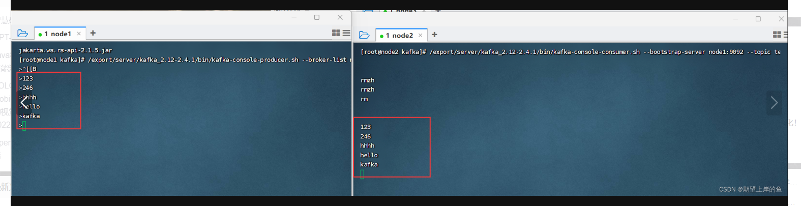

### 下载
#### 华为云镜像站
sudo wget https://mirrors.huaweicloud.com/apache/kafka/3.7.1/kafka_2.13-3.7.1.tgz

### 解压

### 配置kafka环境变量
cat > /etc/profile.d/kafka.sh <<'EOF'
#!/bin/bash
export KAFKA_HOME=/opt/module/kafka_2.13-3.7.1
export PATH=$PATH:${KAFKA_HOME}/bin
EOF

- 立即生效
source /etc/profile.d/kafka.sh

### 配置server.properties核心文件

- 节点唯一标识（必须集群内唯一）
> broker.id=1
- 数据存储目录（建议使用高性能磁盘）
> log.dirs=/opt/module/kafka_2.13-3.7.1/data
- ZooKeeper集群连接配置
> zookeeper.connect=hadoop-dn1:2181,hadoop-dn2:2181,hadoop-dn3:2181

### 分发文件
xsync

### 启动

1. 先启动zookeeper
2. 编写shell脚本启动kafka集群
``` shell 
#!/bin/bash

if [ $# -lt 1 ]
then
    echo "No Args Input..."
    exit ;
fi

case $1 in
"start")
        echo " =================== 启动 Kafka集群 ==================="

        echo " --------------- 启动 master ---------------"
        ssh master "nohup /opt/module/kafka_2.13-3.7.1/bin/kafka-server-start.sh /opt/module/kafka_2.13-3.7.1/config/server.properties >> /opt/module/kafka_2.13-3.7.1/kafka-server.log 2>&1 &"
        echo " --------------- 启动 slave-dn1 ---------------"
        ssh slave-dn1 "nohup /opt/module/kafka_2.13-3.7.1/bin/kafka-server-start.sh /opt/module/kafka_2.13-3.7.1/config/server.properties >> /opt/module/kafka_2.13-3.7.1/kafka-server.log 2>&1 &"
        echo " --------------- 启动 slave-dn2 ---------------"
        ssh slave-dn2 "nohup /opt/module/kafka_2.13-3.7.1/bin/kafka-server-start.sh /opt/module/kafka_2.13-3.7.1/config/server.properties >> /opt/module/kafka_2.13-3.7.1/kafka-server.log 2>&1 &"
;;
"stop")
        echo " =================== 关闭 Kafka 集群 ==================="

        echo " --------------- 关闭 master ---------------"
        ssh master "/opt/module/kafka_2.13-3.7.1/bin/kafka-server-stop.sh"
        echo " --------------- 关闭 slave-dn1 ---------------"
        ssh slave-dn1 "/opt/module/kafka_2.13-3.7.1/bin/kafka-server-stop.sh"
        echo " --------------- 关闭 slave-dn2 ---------------"
        ssh master "/opt/module/kafka_2.13-3.7.1/bin/kafka-server-stop.sh"
;;
*)
    echo "Input Args Error..."
;;
esac
```


3. 在zookeeper上查看是否已经注册成功kafka：
> 1. 启动Zookeeper客户端：`/zkCli.sh -server localhost:2181`
> 2. 查看Kafka Broker信息: `ls /brokers/ids`  如果能成功列出/brokers/ids中的节点信息，说明对应的Kafka节点已成功注册到Zookeeper。
> 3. 推出zookeeper： `quit`


4. kafka测试：
- 在node1执行，创建一个主题
./kafka-topics.sh --create --bootstrap-server master:9092 --replication-factor 1 --partitions 3 --topic FirstTest

- 打开一个终端页面，启动一个模拟的数据生产者
/opt/module/kafka_2.13-3.7.1/bin/kafka-console-producer.sh --broker-list master:9092 --topic FirstTest
- 再打开一个新的终端页面，在启动一个模拟的数据消费者
/opt/module/kafka_2.13-3.7.1/bin/kafka-console-consumer.sh --bootstrap-server master:9092 --topic FirstTest --from-beginning


查看主题详情：
kafka-topics.sh --describe \
  --bootstrap-server master:9092 \
  --topic FirstTest



> 左边输入，右边能同步输出，就成功啦！


### 问题总结

1. 这个错误是因为您使用的 Kafka 版本（3.7.1）已经不再支持通过 ZooKeeper 直接管理主题。从 Kafka 2.2+ 版本开始，官方推荐使用 --bootstrap-server参数替代 --zookeeper参数。