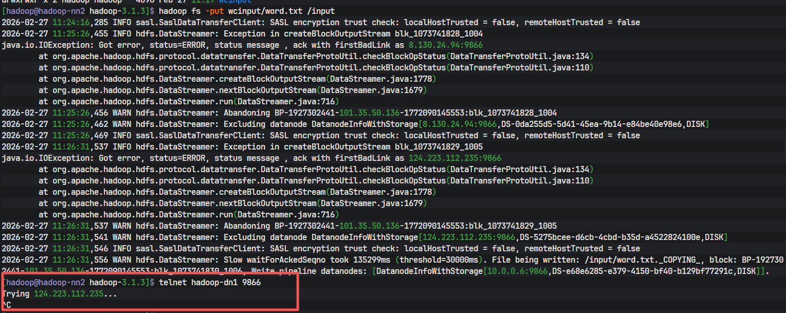

### hadoop 集群问题
1. 问题描述
> 使用的是阿里云和腾讯云服务器，hadoop需要的端口8088，9870，9868等已经在云服务器上开放，但是hadoop启动时，hadoop日志一直显示9870，8088，9868端口被占用。使用命令`jps`没有NameNode,SecondaryNameNode和ResourceManager的进程

2. 问题原因：
> 因为使用的是云服务器，大概率是hosts文件的内网ip和公网ip配置错误

3. 问题解决流程
> 1. 先查看etc/hadoop/目录下的四个文件的ip和端口号是否写成功
> 2. 修改hosts文件

4. 问题修改
> 在前言中末尾提到过笔者的集群为三台机器，所以笔者的hosts文件中ip映射有三行自己添加的代码，大家可以根据自己实际情况适当修改，但是此处ip映射关系一定不能出错！！

    对于master结点，需要在文件末尾添加的内容为：
    master结点的内网ip master
    另一个机器1的公网ip slave1
    另一个机器2的公网ip slave2

    对于slave1结点，需要在文件末尾添加的内容为：
    master结点的公网ip master
    slave1结点的内网ip slave1
    另一个机器2的公网ip slave2

    对于slave2结点，需要在文件末尾添加的内容为：
    master结点的公网ip master
    slave1结点的公网ip slave1
    slave2结点的内网ip slave2
    ***总而言之，对于自己机器上的ip映射就填自己的内网ip，自己机器上对其他ip的映射就是他们的公网ip ***

### hadoop上传文件文通

> 如上图所示：这是一个典型的 HDFS写入管道故障​ 问题。简单来说，客户端在向HDFS写入数据时，连续有数据节点（DataNode）响应失败，导致写入过程异常缓慢并面临中断风险。
> 上图的红框中就是测试访问端口：9866没有访问通过

1. 解决方案
在云服务器上开通9866端口