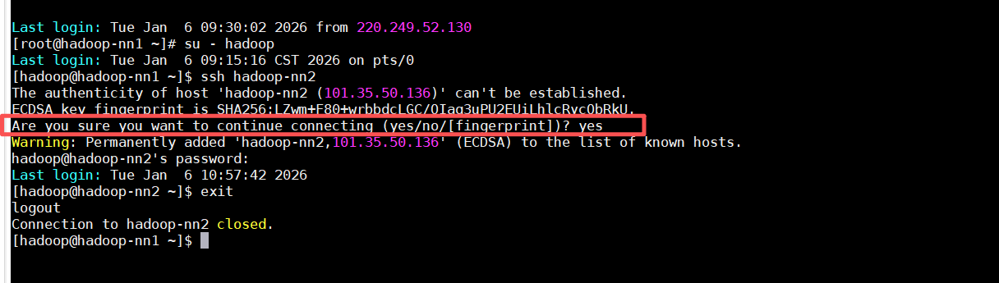
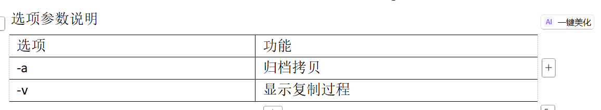
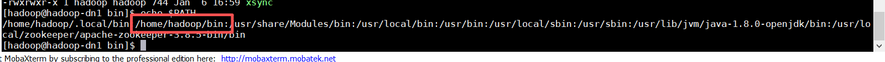

# 安装部署文档

>  有一些问题是需要提前确认的
>  1. 固定的服务器还是云服务器？
>    - 这是有区别的，云服务器是需要开放端口的，zookeeper中使用的2888、3888等。都是要手动上云服务器运营商的控制台去手动配置。配置完成后需要重启服务器

## 基础环境准备
### 1。系统配置
> 1. 配置静态IP
> 2. 修改主机名
> 3. 配置主机映射
> 4. 关闭防火墙和SELinux
> 5. 重启电脑  
> **注意：以上步骤的详细操作，请查看《系统设置.md》**
### 2. 基础环境
> 1. 先对yum环境进行配置 ：`yum update`
> 2. 查看yum上可以下载的java版本：`yum search java | grep jdk`
> 3. 下载并安装版本为1.8的java：`yum install -y java-1.8.0-openjdk-devel`
> 4. 检查java是否安装成功：`java -version`
> 5. 配置java环境变量：①打开环境变量配置文件：`sudo vim /etc/profile`、
>    ②在文件末尾添加如下内容：`export JAVA_HOME=/usr/lib/jvm/java-1.8.0-openjdk`、
>                         `export PATH=$JAVA_HOME/bin:$PATH`
> 6. 启动配置文件：`source /etc/profile`
> 7. 查看java环境变量：`echo $JAVA_HOME`

### 3. 创建专用用户
>**创建用户** ：为Hadoop创建一个专用普通用户（如 hadoop），避免使用root权限直接运行，更安全
> 1. 创建hadoop用户：`useradd hadoop`
> 2. 设置hadoop用户密码：`passwd hadoop`  `密码：Had@wang@1995`
> 3. 配置hadoop用户具有root权限，方便后期hadoop用户在输入命令时，加上sudo 执行root命令:
>    1.`vim /etc/sudoers`  在 %wheel 的下一行添
> 4. `
### 4. 配置SSH免密登录
> 1. ssh连接的基本语法：ssh 另一台电脑的IP地址。例如：`ssh hadoop-nn2`
>    1. 如果出现以下内容：，输入 yes ，输入密码，回车。登录成功
>    2. `exit` 命令是退出ssh免密登录
> 2. 配置SSH免密登录：
>    1. 生成密钥的地址: `/home/hadoop/.ssh`
>    2. 发起公钥请求：`ssh-keygen -t rsa`
>    3. 生成了两个文件：`id_rsa`(私钥)和`id_rsa.pub`(公钥)
>    4. 将公钥文件拷贝到要免密登录的服务器中：`ssh-copy-id hadoop-nn2`

### 5. 编写集群分发脚本”xsync“

> 1. scp 安全拷贝
>   1. scp 定义 ：scp主要是用于实现服务器与服务器之间的拷贝
>   2. 基本语法：`scp -r [要拷贝的文件路径/文件名] 目的服务器的用户名@服务器IP地址:目标路径`
> 2. rsync远程 **同步工具**
>   1. rsync 定义：rsync主要用于备份和镜像。具有速度快、避免复制相同内容和支持符号连接的有点
>   2. rsync和scp对比：用rsync做文件的复制要比scp快很多，因为rsync会检查文件是否已经存在，如果存在就不再复制，而scp会重新复制文件。
>   3. 基本用法：`rsync -av  [要同步的文件路径/文件名] 目的服务器的用户名@服务器IP地址:目标路径`
>   4. 参数作用 
> 3. xsync
>    1. xsync 集群分发脚本如果期望在任何路劲都能执行，那么脚本需要放在声明了全局变量的路径下。
>    
>    2. 脚本实现：
>       1. `cd /home/hadoop`
>       2. `mkdir bin`
>       3. `cd bin`
>       4. `vim xsync`(编写代码在《xsync详解.md》)
>       

### 6. 集群搭建示意图

| 节点名称 | NameNode | ZKFC | ResourceManager | DataNode | NodeManager | JournalNode  | ZooKeeper | JobHistoryServer |
|:--------:|:--------:|:----:|:----:|:--------:|:----:|:----:|:----:|:----------------:|
hadoop-nn1 |    √     |  √  | √  |    ×     | × | × | × |        ×         |
hadoop-nn2 |    √     |  √  | √  |    ×     | × | × | × |        ×         |
hadoop-dn1 |    ×     |   ×   | × |     √     | √ | √ | √ |        ×         |
hadoop-dn2 |    ×     |   ×   | × |     √     | √ | √ | √ |        ×         |
hadoop-dn3 |    ×     |   ×   | × |     √     | √ | √ | √ |        √         |

### 7. 安装Zookeeper（集群）
> 1. Zookeeper下载地址：`https://zookeeper.apache.org/releases.html `
> 2. 上传Zookeeper压缩包的路径：`/opt/software/`
> 3. 将Zookeeper压缩包解压到指定目录下：`tar -xzvf apache-zookeeper-3.8.5-bin.tar.gz -C /opt/moudle/apache-zookeeper-3.8.5-bin`
> 4. 配置环境变量：
>    1. 打开环境变量配置文件：`sudo vim /etc/profile`
>    2. 文件末尾添加内容：`export ZOOKEEPER_HOME=/opt/software/apache-zookeeper-3.8.5-bin`
>                      `export PATH=$PATH:$JAVA_HOME/bin:$ZOOKEEPER_HOME/bin`
> 5. 启动配置文件：`source /etc/profile`
> 6. 集群配置：
>    1. 创建数据存储及日志目录:
>       `mkdir -p /opt/module/apache-zookeeper-3.8.5-bin/data`
>       `mkdir -p /opt/module/apache-zookeeper-3.8.5-bin/log`
>    2. 备份配置文件：
>       `cd /opt/module/apache-zookeeper-3.8.5-bin/conf`
>       `cp zoo_sample.cfg zoo.cfg`
>    3. 修改配置文件：详情见《Zookeeper.md》Zookeeper.md
>    4. 进行服务器分发：` xsync /opt/module/apache-zookeeper-3.8.5-bin/`
>    5. 编写myid：
>               在机器1上执行
>                    `echo 1 >/opt/module/apache-zookeeper-3.8.5-bin/data/myid`
>               在机器2上执行
>                    `echo 2 >/opt/module/apache-zookeeper-3.8.5-bin/data/myid`
>               在机器3上执行
>                    `echo 3 >/opt/module/apache-zookeeper-3.8.5-bin/data/myid`

>    6. 启动zookeeper